# Marketing OS — Arquitetura do Sistema

> Documentação técnica completa. Renderizar com **Markdown Preview Enhanced** no VSCode.
> Última atualização: 2026-02-18

---

## Índice

1. [Visão Geral](#1-visão-geral)
2. [Camadas do Sistema](#2-camadas-do-sistema)
3. [Fluxo Principal de Request](#3-fluxo-principal-de-request)
4. [Sistemas Paralelos (A vs B)](#4-sistemas-paralelos-a-vs-b)
5. [Arquitetura de Subagentes](#5-arquitetura-de-subagentes)
6. [Sistema de Clones](#6-sistema-de-clones)
7. [Fluxo: Reels de 90 Segundos](#7-fluxo-reels-de-90-segundos)
8. [Integrações MCP](#8-integrações-mcp)
9. [Scripts Python](#9-scripts-python)
10. [Mapa de Arquivos](#10-mapa-de-arquivos)

---

## 1. Visão Geral

Marketing OS é um sistema operacional de marketing digital com **duas camadas de entrada**, **17 subagentes especializados**, **34 clones de voz** e **30+ scripts Python**.

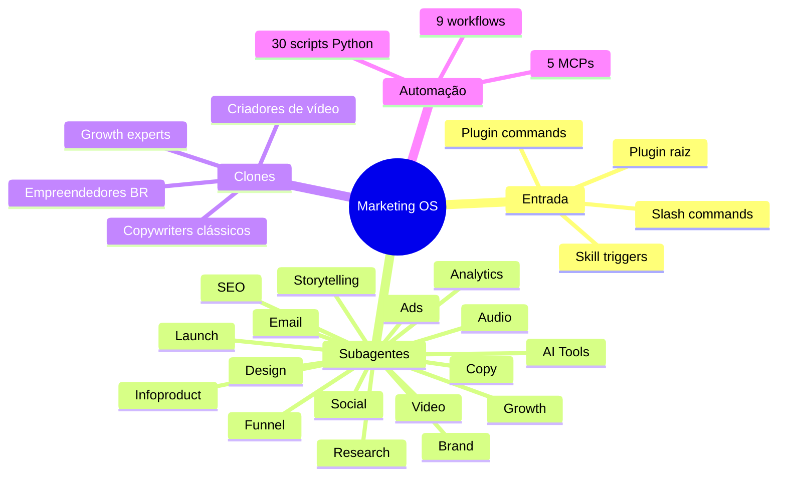

---

## 2. Camadas do Sistema

```mermaid
graph TB
    subgraph ENTRADA["🚪 Camada de Entrada"]
        P1["plugin.json\n(raiz / Sistema A)"]
        P2[".claude-plugin/plugin.json\n(marketing-os / Sistema B)"]
        CMD["24 Slash Commands\n/criar-video, /criar-post..."]
        SKILL["Skill Trigger\n(palavra-chave no chat)"]
    end

    subgraph ORQUESTRADOR["🎛️ Camada de Orquestração"]
        MOS["marketing-os SKILL.md\nOrquestrador Principal"]
        CM["Clone Manifest\nclone-manifest.yaml"]
        BRIEF["Briefing Engine\nColeta: nicho, objetivo,\npúblico, tom, CTA"]
    end

    subgraph AGENTES["🤖 Camada de Subagentes (17)"]
        VA["Video Agent"]
        CA["Copy Agent"]
        SA["Social Agent"]
        SEO["SEO Agent"]
        RA["Research Agent"]
        AA["Audio Agent"]
        DA["Design Agent"]
        AN["Analytics Agent"]
        EA["Email Agent"]
        ADS["Ads Agent"]
        BA["Brand Agent"]
        STA["Storytelling Agent"]
        FA["Funnel Agent"]
        GA["Growth Agent"]
        LA["Launch Agent"]
        AIT["AI Tools Agent"]
        IA["Infoproduct Agent"]
    end

    subgraph CLONES["🎭 Camada de Clones (34)"]
        VIRAL["Viral\nMrBeast"]
        COPY["Copywriting\nHormozi · Halbert · Schwartz"]
        EDU["Educativo\nAbdaal · Ogilvy"]
        BR["Brasileiro\nFlávio · Joel Jota · Conrado"]
        VENDA["Vendas\nBrunson · Suby · Kennedy"]
    end

    subgraph OUTPUT["📦 Camada de Output"]
        ROT["Roteiro / Script"]
        POST["Post / Caption"]
        ART["Artigo SEO"]
        EMAIL["Email / Sequência"]
        RELAT["Relatório Analytics"]
        NOTION["→ Notion MCP"]
    end

    P1 --> MOS
    P2 --> CMD
    CMD --> MOS
    SKILL --> MOS
    MOS --> BRIEF
    BRIEF --> CM
    CM --> AGENTES
    MOS --> AGENTES
    AGENTES --> CLONES
    CLONES --> OUTPUT

    style ENTRADA fill:#1a1a2e,color:#eee,stroke:#4a4a8a
    style ORQUESTRADOR fill:#16213e,color:#eee,stroke:#4a4a8a
    style AGENTES fill:#0f3460,color:#eee,stroke:#4a4a8a
    style CLONES fill:#533483,color:#eee,stroke:#8a4aaa
    style OUTPUT fill:#0d7377,color:#eee,stroke:#14a085
```

---

## 3. Fluxo Principal de Request

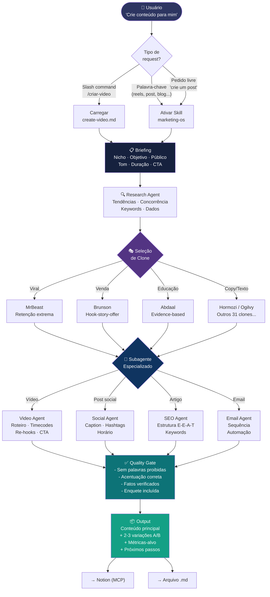

---

## 4. Sistemas Paralelos (A vs B)

O Marketing OS tem dois sistemas em execução paralela. Entender a diferença é crítico.

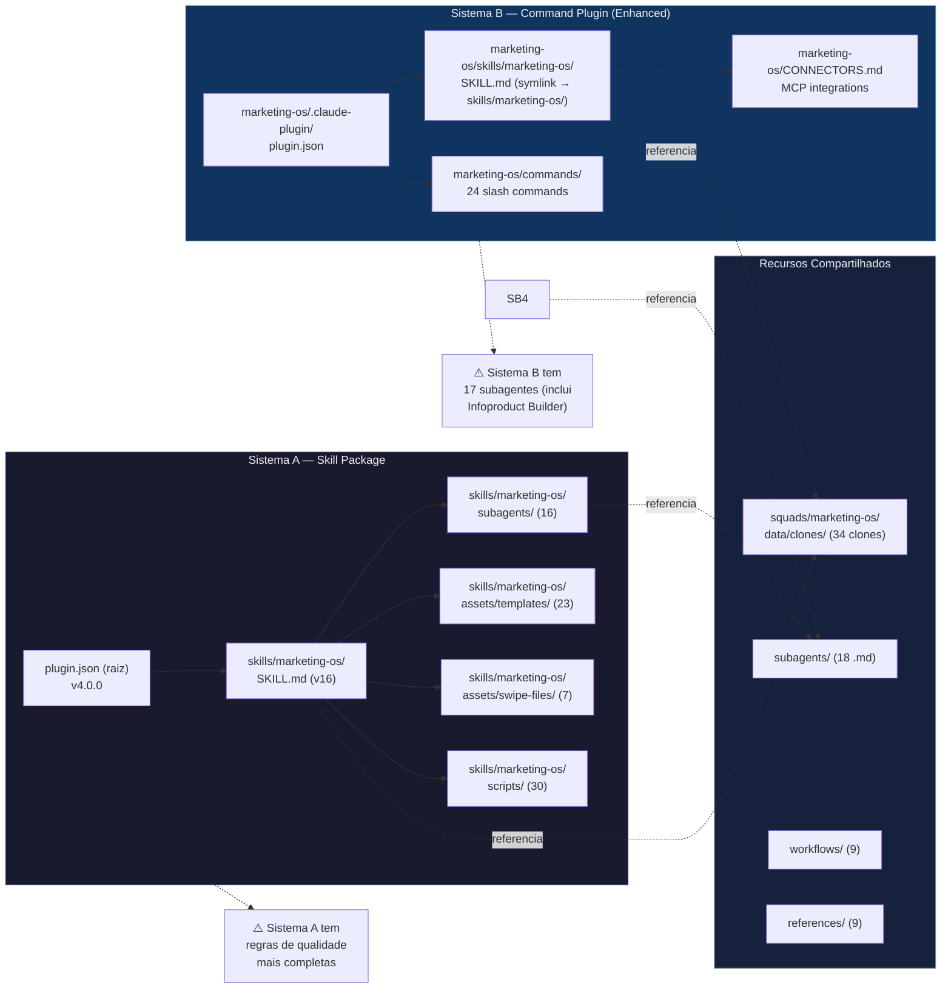

### Diferenças Críticas

| Característica | Sistema A | Sistema B |
|---|---|---|
| Subagentes | 16 | 17 (+ Infoproduct Builder) |
| Interface | Skill trigger | 24 slash commands |
| Palavras proibidas | ✅ Completo | ✅ Sincronizado (corrigido 2026-02-18) |
| Verificação de fatos | ✅ Obrigatória | ✅ Sincronizado (corrigido 2026-02-18) |
| Enquetes obrigatórias | ✅ Sim | ✅ Sincronizado (corrigido 2026-02-18) |
| Checklist qualidade | 11 itens | 11 itens (sincronizado) |
| MCPs integrados | Não | Notion, Figma, Canva, Slack, SimilarWeb |
| Batch production | Não | `/batch` command |

---

## 5. Arquitetura de Subagentes

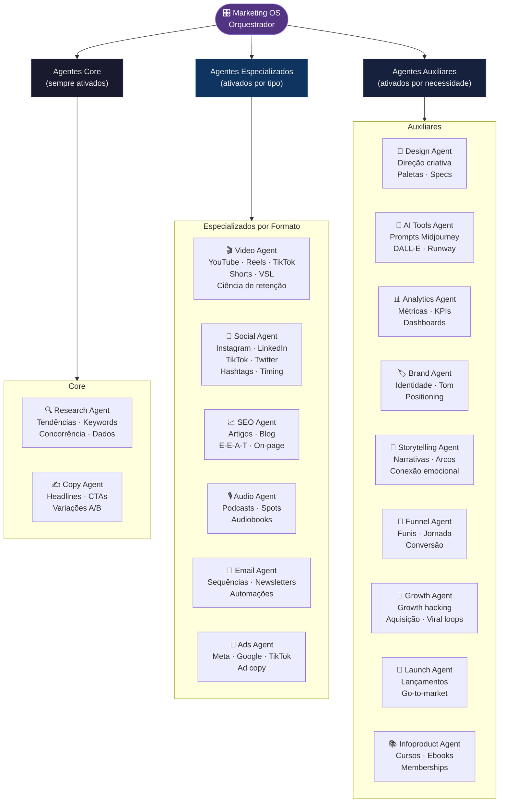

### Quando cada agente é ativado

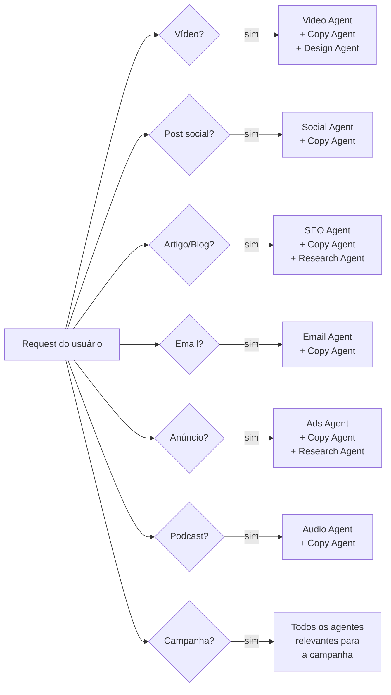

---

## 6. Sistema de Clones

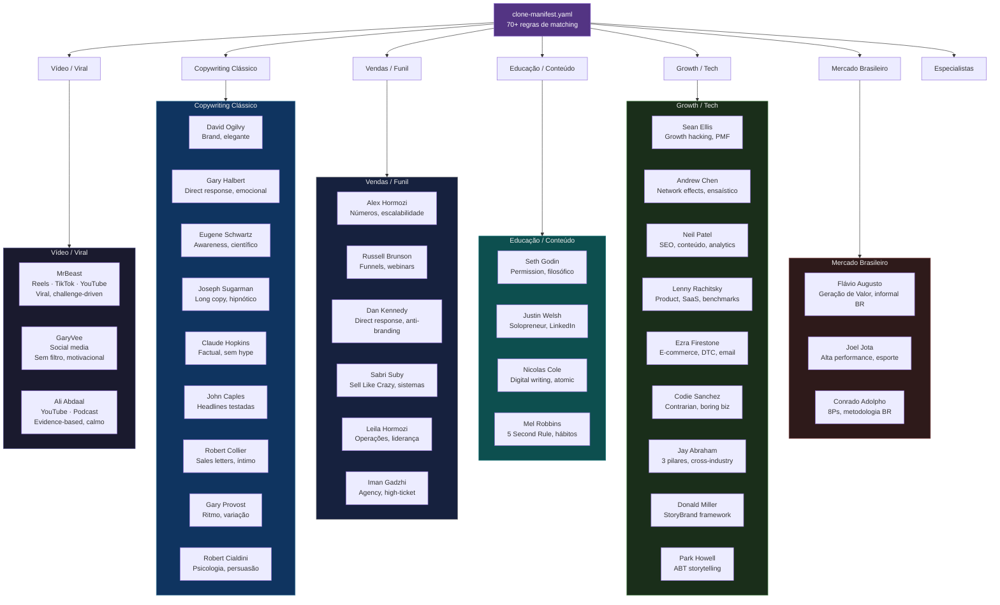

### Regras de Seleção de Clone por Content Type

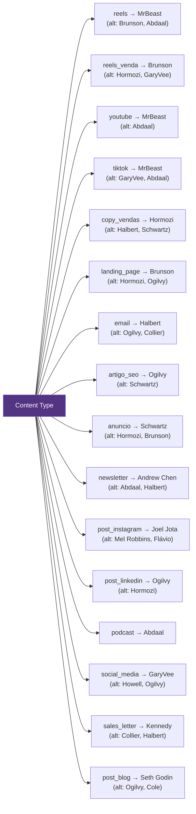

---

## 7. Fluxo: Reels de 90 Segundos

Exemplo detalhado do pipeline completo para o caso de uso mais comum.

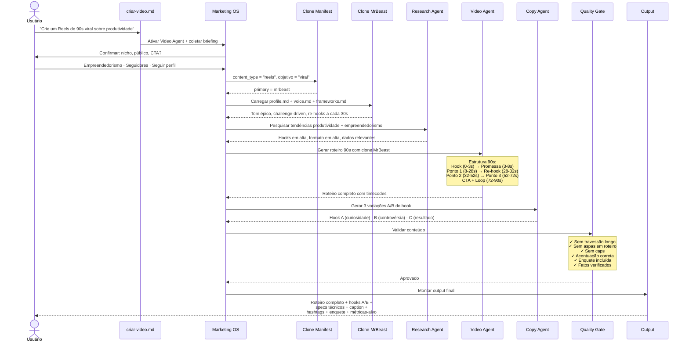

### Estrutura Interna do Roteiro de 90s

```mermaid
gantt
    title Estrutura de Reels 90 Segundos
    dateFormat ss
    axisFormat %Ss

    section Atenção
    HOOK — Pattern interrupt visual + Frase de parada de scroll    : crit, 00, 3s
    PROMESSA — O que vão aprender / ganhar                        : 03, 5s

    section Conteúdo
    PONTO 1 — Primeiro insight com exemplo real                    : 08, 20s
    RE-HOOK — Frase que recupera atenção (obrigatório)            : crit, 28, 4s
    PONTO 2 — Segundo insight com prova/dado                      : 32, 20s
    PONTO 3 — Insight mais surpreendente (melhor para o final)    : 52, 20s

    section Conversão
    CTA + LOOP — Ação clara + frase que conecta ao início         : crit, 72, 18s
```

---

## 8. Integrações MCP

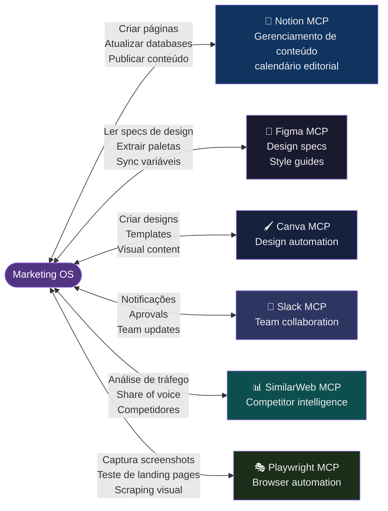

---

## 9. Scripts Python

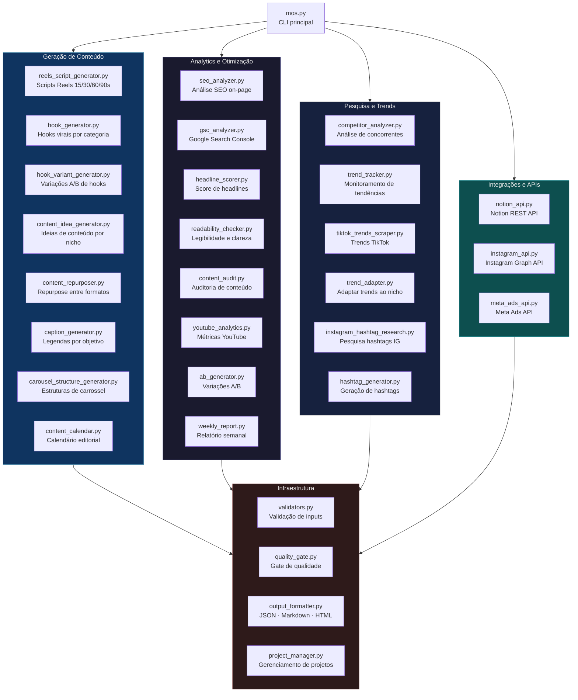

---

## 10. Mapa de Arquivos

```mermaid
graph TD
    ROOT["📁 Marketing OS/"]

    ROOT --> SK["📁 skills/marketing-os/\nSistema A — Skill Package"]
    ROOT --> MO["📁 marketing-os/\nSistema B — Command Plugin"]
    ROOT --> SQ["📁 squads/marketing-os/\nDados e Clones"]
    ROOT --> SC["📁 scripts/\n30 scripts Python"]
    ROOT --> WF["📁 workflows/\n9 workflows"]
    ROOT --> RF["📁 references/\n9 arquivos de referência"]
    ROOT --> SA["📁 subagents/\n18 subagentes .md"]
    ROOT --> DC["📁 docs/\nDocumentação"]
    ROOT --> CL["📁 .claude/\nCommands e Regras"]

    SK --> SK1["SKILL.md (v16)\nOrquestrador"]
    SK --> SK2["subagents/ (16)"]
    SK --> SK3["assets/\ntemplates · swipe-files\nframeworks · checklists"]
    SK --> SK4["scripts/ (symlink)"]
    SK --> SK5["references/ (symlink)"]

    MO --> MO1["skills/marketing-os/\nSKILL.md (v5.0 / 17 agents)"]
    MO --> MO2["commands/ (24)\n/criar-video · /criar-post..."]
    MO --> MO3["skills/ (19 packages\nindividuais)"]
    MO --> MO4[".claude-plugin/\nplugin.json"]
    MO --> MO5["CONNECTORS.md\nMCPs documentados"]

    SQ --> SQ1["data/clones/\nclone-manifest.yaml\n+ 34 pastas de clones"]
    SQ --> SQ2["cada clone/\nprofile.md · voice.md\nframeworks.md · examples.md"]

    CL --> CL1["commands/\nmarketing-os.md (v11 → sync)"]
    CL --> CL2["rules/\nworkflow-execution.md\nstory-lifecycle.md\nids-principles.md\nagent-authority.md"]

    style ROOT fill:#533483,color:#fff
    style SK fill:#0f3460,color:#eee,stroke:#4a8aaa
    style MO fill:#1a1a2e,color:#eee,stroke:#4a4a8a
    style SQ fill:#16213e,color:#eee,stroke:#888
    style SC fill:#0d4f4f,color:#eee,stroke:#0d7377
    style CL fill:#2e1a1a,color:#eee,stroke:#8a4a4a
```

---

## Resumo Executivo

| Componente | Quantidade | Localização |
|---|---|---|
| Sistemas de entrada | 2 (A + B) | `plugin.json` raiz + `marketing-os/.claude-plugin/` |
| Slash commands | 24 | `marketing-os/commands/` |
| Subagentes | 18 | `subagents/` + `skills/marketing-os/subagents/` |
| Clones de voz | 34 | `squads/marketing-os/data/clones/` |
| Regras de matching | 70+ | `clone-manifest.yaml` |
| Templates | 23+ | `skills/marketing-os/assets/templates/` |
| Swipe files | 7 | `skills/marketing-os/assets/swipe-files/` |
| Workflows | 9 | `workflows/` |
| Scripts Python | 30+ | `scripts/` |
| Integrações MCP | 6 | Notion · Figma · Canva · Slack · SimilarWeb · Playwright |
| Nichos suportados | 10+ | `references/niches.md` |

---

*Última atualização: 2026-05-06 (plugin-first refactor)*
*Renderizar com Markdown Preview Enhanced (VSCode)*
